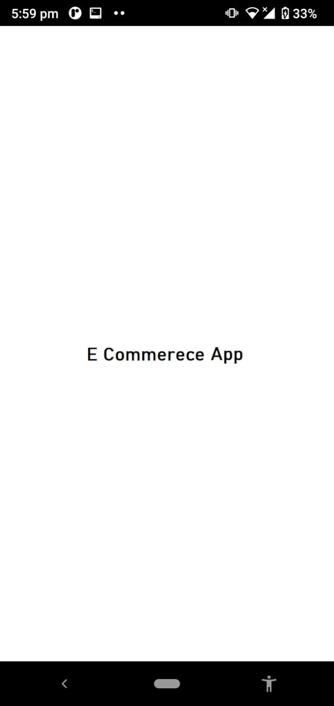
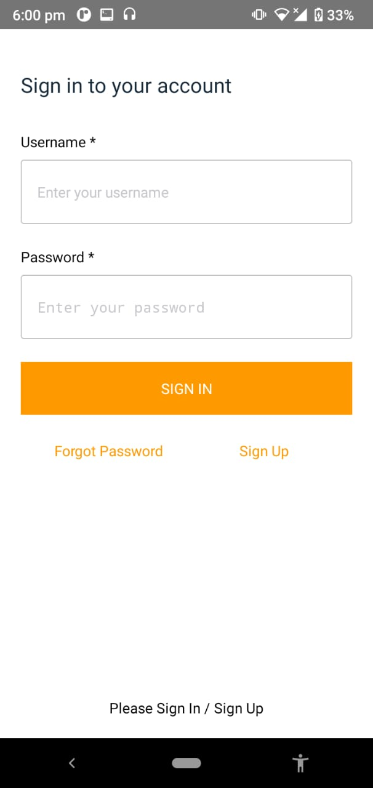
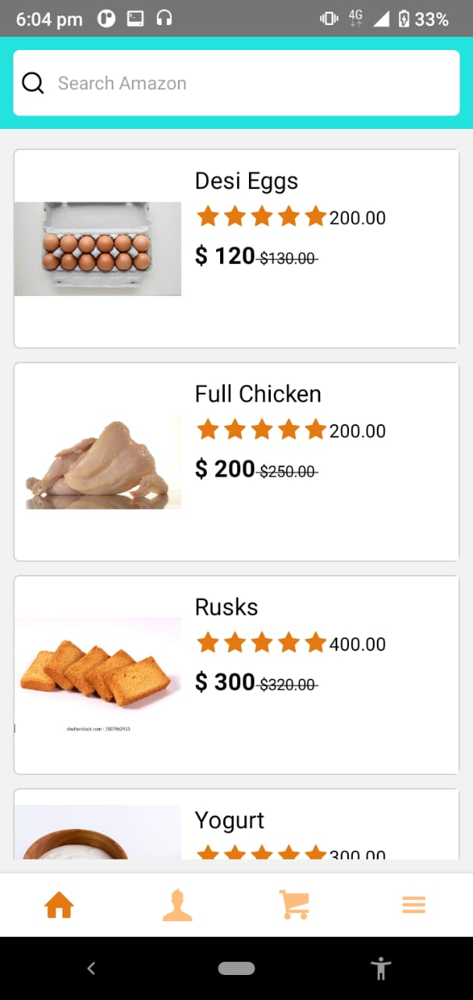
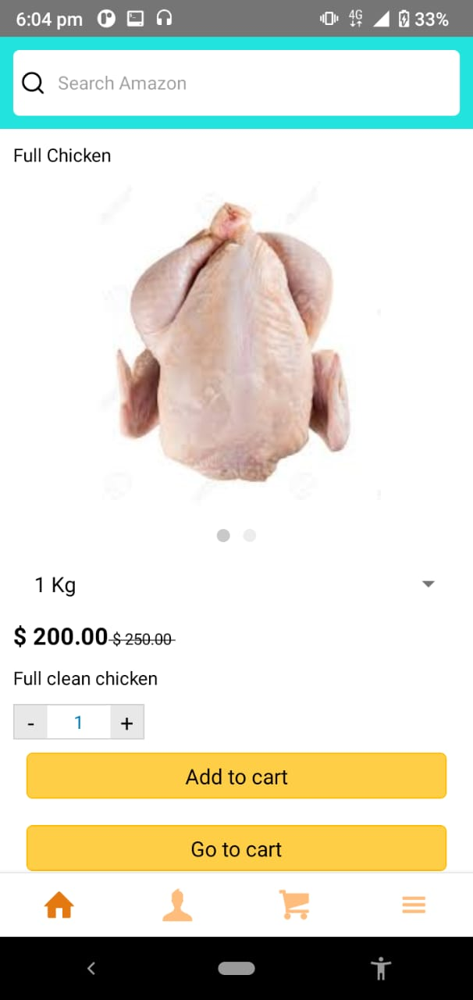
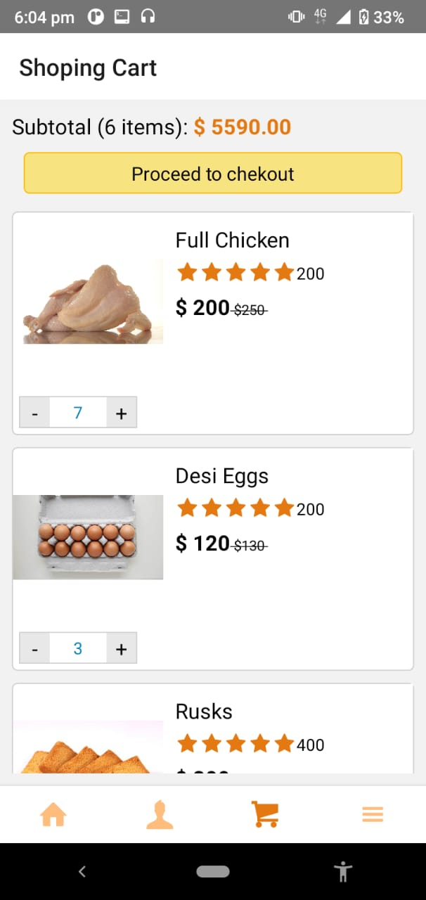
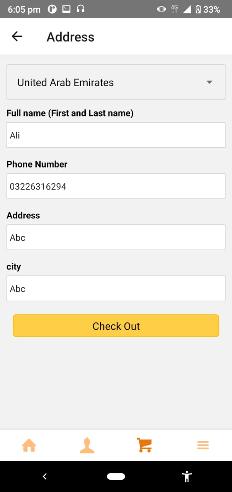
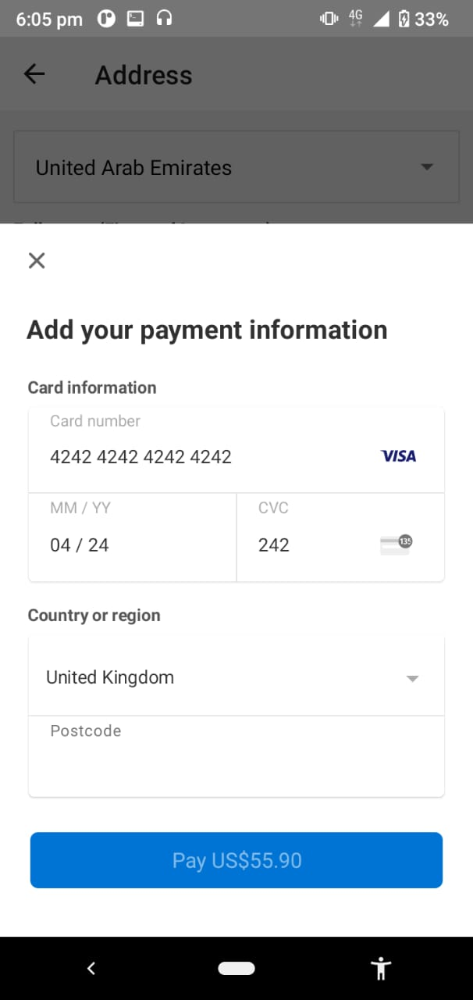
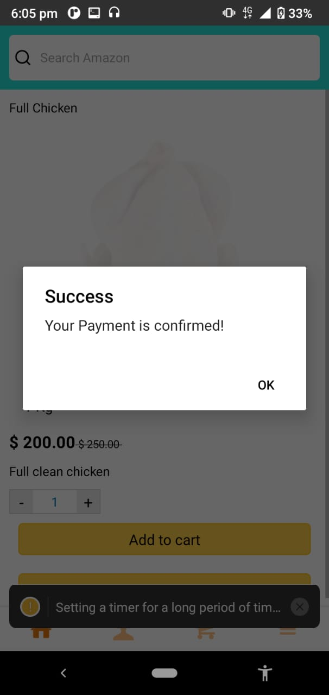

# Ecommerece-App (Amazon clone)

Front End:  
<od>
  <li>Splash Screen </li>
  <li>aws Authentication </li>
  <li>Bottom Tab for navigation </li>
  <li>Drawer Tab for navigation </li>
</od>
Back End:  
<od>
  <li>aws Amplify </li>
  <li>aws Lamba functions </li>
  <li>aws DataStore </li>
  <li>Drawer Tab for navigation </li>
  <li>DataStore </li>
</od>

Screen Overreview:

